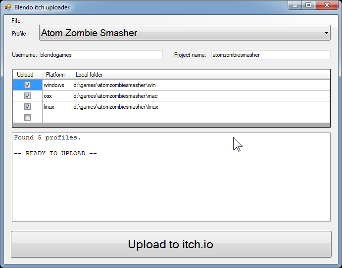

# Blendo itch uploader
 

## About
I made a gui wrapper around itch.io's Butler command-line program, to streamline my build process.

This is written in C# and a .sln solution for Visual Studio 2010 is provided. Windows only.

## Installation
1. Download [Butler](https://fasterthanlime.itch.io/butler) and put it into a folder.
2. Place Blendo itch uploader into the same folder. Pre-compiled executable is available at [my itch.io page](https://blendogames.itch.io/blendo-itch-uploader).
3. Run Blendo itch uploader.

## License
This source code is licensed under the zlib license. Read the license details here: [LICENSE.md](https://github.com/blendogames/itch_butler_gui/blob/master/license.md)

## Credits
by [Brendon Chung](http://blendogames.com)

## Libraries used
- [Butler](https://github.com/itchio/butler)
- [Json.NET](https://www.newtonsoft.com/json)
